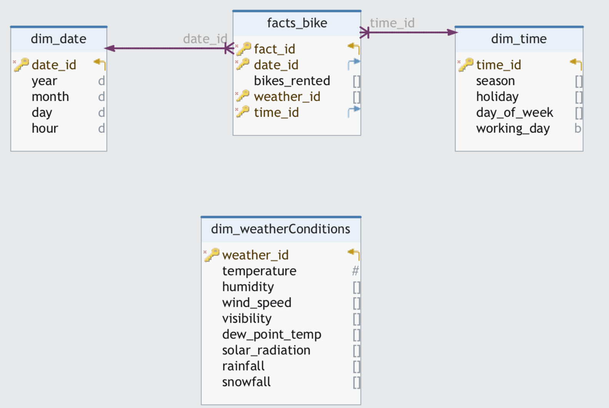
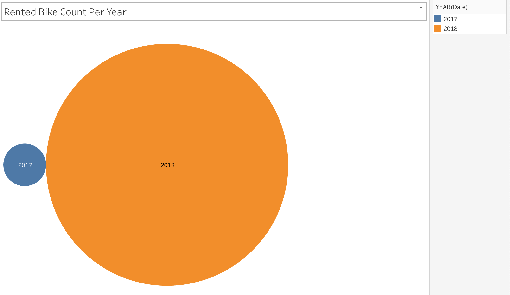
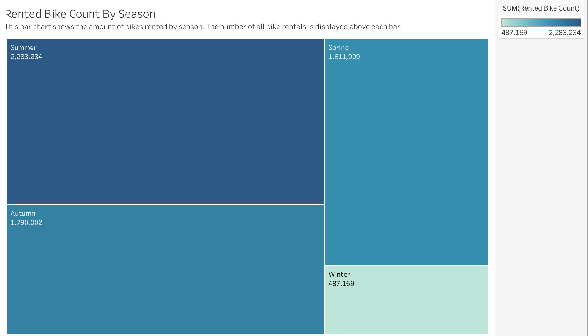
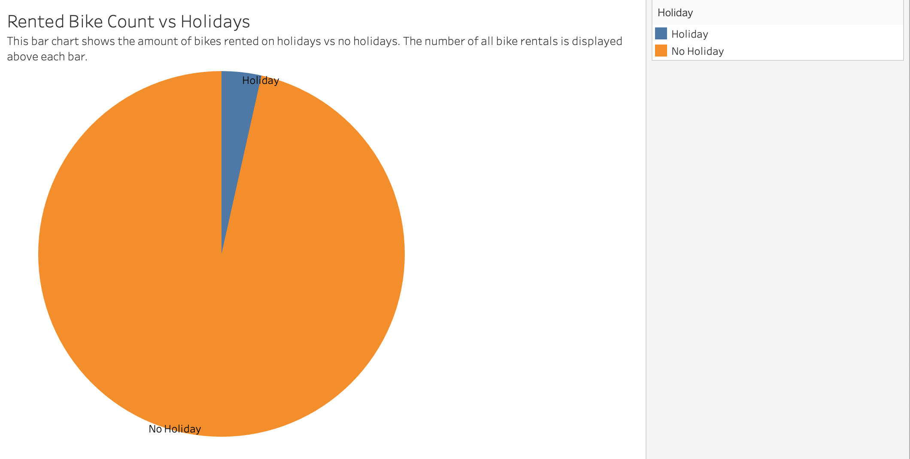

# Seoul Bike Sharing Demand Data 
## Data Warehousing Project - CIS 4400
### Nidhi Shah 

# Description
This project is a data warehousing solution designed to source, store, and model data from the UC Irvine Machine Learning Repository about rental bikes introduced in urban cities. It aims to provide a centralized repository for analyzing and visualizing hourly bike counts based on hours of the day, temperature, rainfall, etc. 

# Business Impacts

## Business Problem
Rental bikes have been introduced to urban cities to improve mobility and comfort. Many citizens will rely on these rental bikes, therefore ensuring their availability and accessibility to the public at the right times. A large concern of the cities implementing these bikes is predicting the number of bikes needed each hour to maintain a stable supply and reduce wait times. 

## Business Persona
The results of this model will interest the government of Seoul, Community Organizers, and Residents.

## Requirements
There must be a model built to predict the demand for rental bikes at different times of the day. This will help in optimizing bike distribution and ensuring a stable supply to meet the expected demand at all times. 

# Data
This dataset is provided by the UC Irvine Machine Learning Repository. The dataset includes weather data (Temperature, Humidity, Windspeed, Visibility, Dewpoint, Solar radiation, Snowfall, Rainfall), hourly bike rental numbers, and date information.

The data source can be found here: [Seoul Bike Sharing Demand](https://urldefense.proofpoint.com/v2/url?u=https-3A__archive.ics.uci.edu_dataset_560_seoul-2Bbike-2Bsharing-2Bdemand&d=DwMF-g&c=dTXc8cCP8suVpClwB1HRHQACHN4UFMgL7MtSjCbKyts&r=oVD6CwqCAH6Yj8wfghbNBvgfCqnSqhyRzWRyCATcfqOIYccPvVHSeK8-T4x5XXNn&m=LM8-TTaIXX9683kw06Yz2S_Izj_hzKwfpa74TsWPhlfllGRpnIfQ7_ZiQZ_Q9t9O&s=ZgBdNqWCBdDrZVvJiazGg_m_ucOOwrv8wzqMOlW7USc&e=)

The data dictionary can be found here: [Data Dictionary](https://archive.ics.uci.edu/dataset/560/seoul+bike+sharing+demand#:~:text=Date%20%3A%20year%2Dmonth,SHOW%20LESS)

## Methods

### Sourcing the data
+ The data was downloaded from the data sources and stored to the local file system
+ In the "[scripts](Scripts/Gathering)" folder, there is a code snippet that will automate the download from url 

### Storing the data
+ The data was then moved into a Storage Container on Microsoft Azure using [this](Scripts/Storing) code.

### Modeling the data
+ Lastly, DbSchema was used to create a dimensional model for the data.
+ In the scripts folder, there is a script to create the model. The code can be found [here](Scripts/Modeling).

### Transforming the data 
+ The data was transformed according to specific business rules. 
+ Examples of **some** transformations that were done: 
    + Unifying date format YYYY-MM-DD
    + Removing null values
    + Removing duplicate values
    + Using the correct data type
+ The data mapping can be found in the 'Data Dictionary' Folder
+ The code for the transformations can be found [here](Scripts/Transforming).

### Updated data model
+ Using LucidChart, the dimensional model was updated to reflect new surrogate keys
+ The updated script for creating this model can be found [here](https://github.com/niidhiishah/Seoul-Bike-Data/blob/main/Scripts/Updated%20Modeling)

### Serving the data 
+ Below are some of the data visualizations. The link to the visualizations can be found [here](https://public.tableau.com/views/SeoulBikeDataVisualizations/BikesRentedonHolidaysFunctioningDays?:language=en-US&publish=yes&:sid=&:display_count=n&:origin=viz_share_link). 

This visual shows the bikes rented per year. 

This visual shows the distribution of bike rentals per season.

This pie chart shows the amount of bikes rented on holidays vs no holidays. 

## Conclusions 
After extracting, loading, transforming, and visualizing this data, we are able to see that the bikes in Seoul are most frequently rented during the summer. There are very few bikes that are rented in the winter, probably due to the colder weather. There was also a major increase in the number of bike rentals from 2017 to 2018, which suggests that after the introduction of the bikes in 2017, they garnered lots of popularity. Finally, we can see that bikes are most rented on functioning days when people are commuting to work, and when there are no holidays. We can assume that most people use these bikes to commute to work. 

## Issues I ran into/Future Considerations
+ Github will not allow you to upload code with your AWS access key, etc. Make sure to remove it and replace with placeholders
+ When attempting to upload a picture to the repo through VS Code, there was a prompt "There are no staged changes to commit. Would you like to stage all your changes and commit them directly?" DO NOT PRESS YES. It makes it very difficult to commit and push changes from that point forward (hence why the data modeling folder has not been displayed)
+ Connecting to the datawarehouse through redshift was extremely tough for me - I think it was because the table I originally created did not match up with the columns of the data.

